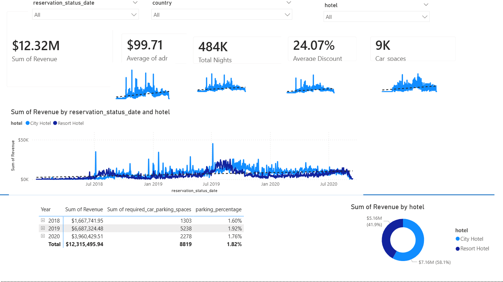

# hotel-revenue-analysis
# Hotel Revenue & Operations Analytics Pipeline

## Project Overview
This project is an end-to-end data analytics pipeline designed to evaluate historical hotel booking data and deliver actionable visual insights to stakeholders. The objective was to engineer a robust database architecture using MySQL, connect it to Power BI, and build a dynamic dashboard to answer three critical business questions:
1. Is hotel revenue growing consistently year-over-year?
2. Is there sufficient demand to justify increasing the parking lot size?
3. What underlying booking trends and seasonalities exist within the data?

## Executive Summary & Business Recommendations
Based on the quantitative modeling and visualization of $12.32M in total revenue, the dashboard provides the following definitive answers for stakeholders:

* **Revenue Growth Analysis:** Revenue experienced explosive growth from 2018 ($1.6M) to 2019 ($6.6M). However, the trend reversed in 2020 ($3.9M), aligning with global travel disruptions. The business should focus on recovery strategies rather than assuming continuous linear growth.
* **Parking Lot Capacity Decision (Recommendation: Do not expand):** The data reveals that the parking space requirement ratio is remarkably low, averaging only 1.82% across all years and never exceeding 2.80% for any specific hotel type. Capital expenditure should be reallocated to other high-ROI areas.
* **Key Booking Trends:**
  * **Property Dominance:** The City Hotel is the primary revenue driver, accounting for 58.1% ($7.16M) of total historical revenue compared to the Resort Hotel's 41.9% ($5.16M).
  * **Seasonality:** Time-series analysis indicates clear seasonal revenue spikes, suggesting marketing spend and dynamic pricing strategies should be aggressively targeted ahead of these peak windows.

---

## Technical Pipeline & Project Architecture

### 1. Backend Data Engineering (SQL Pipeline)
To ensure optimal performance and accuracy for the final quantitative analysis, the raw dataset was processed through a custom ETL (Extract, Transform, Load) pipeline using MySQL. 

The `01_hotel_revenue_etl.sql` script executes the following database operations:
* **Bulk Data Ingestion:** Utilized `LOAD DATA LOCAL INFILE` to efficiently import over 100,000+ rows of raw CSV data into staging tables.
* **Data Consolidation:** Appended separated historical datasets (2018, 2019, and 2020) into a single, unified master table using `UNION ALL`.
* **Relational Joins:** Executed `LEFT JOIN` operations to merge the central fact table with dimensional reference tables (`market_segment` and `meal`). This crucial step integrated specific discount percentages and meal costs directly into the booking records, establishing a flat, optimized schema ready for complex financial modeling.

### 2. Frontend Data Modeling & Visualization (Power BI)
The `Hotel_revenue.pbix` file contains the final relational data model, custom calculated metrics, and the interactive dashboard designed to answer the core business questions. 

Key technical implementations within Power BI include:
* **Data Transformation (Power Query):** Cleaned and structured the imported SQL views, formatting text strings into proper chronological Date hierarchies to enable accurate time-series analysis and forecasting.
* **Quantitative Modeling (DAX):** Engineered complex custom measures to calculate critical business KPIs. This included dynamic aggregations for `Total_Revenue` (factoring in length of stay, variable daily rates, and segment-specific discounts) and safe division operations (`DIVIDE`) to determine the `parking_percentage` capacity ratios.
* **Interactive Dashboard UI:** Designed a polished, executive-level interface featuring KPI cards for high-level metrics, smoothed line charts for seasonal trend analysis, and matrix visualizations to track financial performance year-over-year. 

### 3. Dashboard Presentation
The `hotel_revenue_dashboard.png` file provides a static, high-resolution view of the final Power BI report. This image serves as a quick-reference guide for the project's visual output, demonstrating the translation of backend SQL engineering into actionable frontend business intelligence. 

---

## Data Source & Context
The dataset utilized for this analysis contains historical hotel booking and revenue records spanning three years. It includes detailed transactional data such as booking dates, length of stay, daily rates, and customer requirements (e.g., parking and meals). 

* **Timeframe:** January 2018 – December 2020
* **Domain:** Hospitality & Property Management
* **Origin:** Public dataset sourced from [AbsentData](https://absentdata.com).

## Data Dictionary
Below is a breakdown of the key fields utilized in the master dataset and custom DAX measures for this analysis.

| Field Name | Description | Data Type |
| :--- | :--- | :--- |
| `arrival_date_year` | The calendar year the guest arrived at the hotel (2018, 2019, or 2020). | Date/Time |
| `stays_in_week_nights` | The number of weeknights (Monday to Friday) the guest stayed or was booked to stay. | Integer |
| `stays_in_weekend_nights` | The number of weekend nights (Saturday and Sunday) the guest stayed or was booked to stay. | Integer |
| `adr` | **Average Daily Rate:** The average rental revenue earned for an occupied room per day. | Decimal (Currency) |
| `market_segment` | The designation of the market the booking originated from (e.g., Corporate, Direct, Online Travel Agent). | Text |
| `Discount` | The specific discount percentage applied to the booking based on its originating `market_segment`. | Decimal (Percentage) |
| `meal` | The type of meal plan or food and beverage package the guest booked. | Text |
| `Cost` | The estimated cost associated with the specific `meal` plan provided. | Decimal (Currency) |
| `required_car_parking_spaces` | The number of parking spaces requested by the guest for their stay. | Integer |
